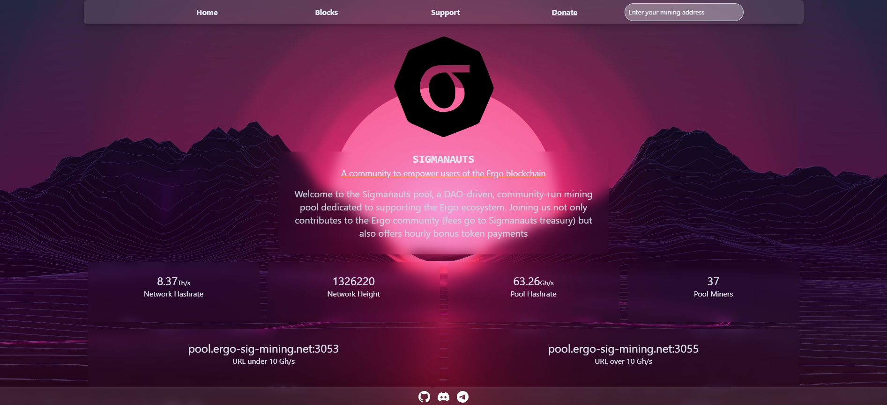
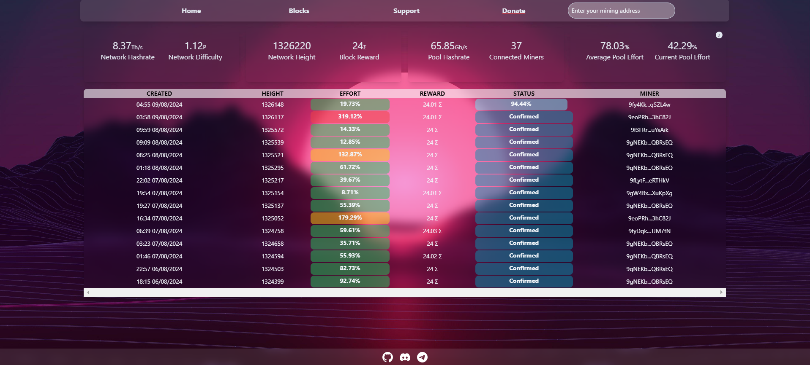
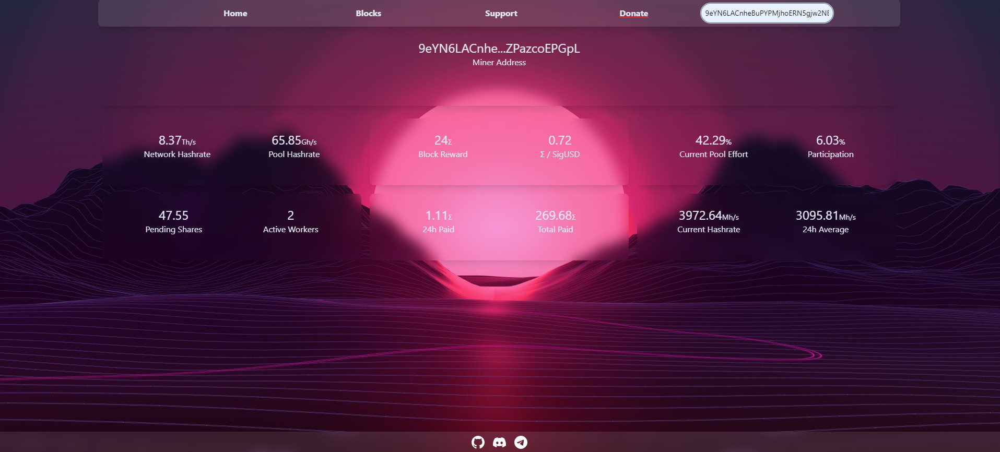

# Sigmanauts Mining Pool

This dashboard is a [Dioxus](https://dioxuslabs.com/) Fullstack app leveraging [Tailwindcss](https://tailwindui.com/) and the [Rust](https://www.rust-lang.org/) programming language.

It is made for the Sigmanauts Mining Pool on the Ergo blockchain, and it is fully written in Rust!

The webapp is live on the following url: http://sigmamining.xyz/

# Gallery



#



#



# Development

1. Install Rust: https://www.rust-lang.org/tools/install
2. install dioxus cli:

```rust
cargo install dioxus-cli
```

3. Install npm: https://docs.npmjs.com/downloading-and-installing-node-js-and-npm
4. Install the tailwind css cli: https://tailwindcss.com/docs/installation
5. Run the following command in the root of the project to start the tailwind CSS compiler:

```bash
npx tailwindcss -i ./input.css -o ./assets/tailwind.css --watch
```

Launch the Dioxus Fullstack app:

```bash
dx serve --platform fullstack
```
